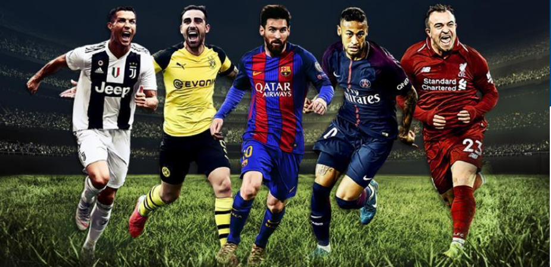

# Analysis of European Soccer, 2008-2016.

This dataset, taken from a [Kaggle dataset repository](https://www.kaggle.com/datasets/hugomathien/soccer), consists of 11 european countries and their respective championships or leagues. There are 25,000 matches plus in the dataset and more than 10,000 players. But for our analysis, we will concentrate on just the top four leagues in Europe: The Premiership in England, the Bundesliga in Germany, La liga in Spain, and Series A in Italy. 

